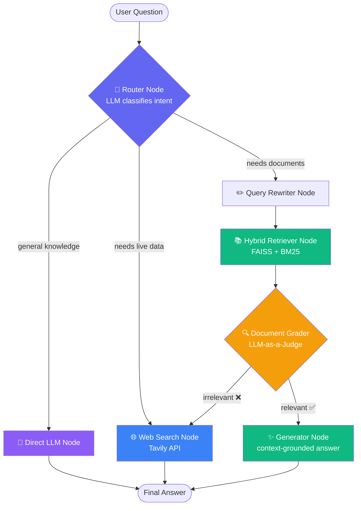

# 🤖 Adaptive RAG — Agentic Retrieval System

> An **agentic RAG pipeline** built with **LangGraph** that doesn't just retrieve-then-generate — it *thinks* about how to answer. Every question is routed to the cheapest, most reliable strategy: a direct LLM answer, a hybrid document search, or a live web search — with self-correction baked in via document grading and automatic fallback.

          

---

## ✨ Why this isn't "just another RAG demo"

Most RAG tutorials retrieve documents for *every* question, even "What is Java?" or "Who won yesterday's match?" — wasting latency and tokens on irrelevant context. This system instead behaves like an **agent making a decision**:

| Question | Route taken | Why |
|---|---|---|
| "Explain OOP concepts" | 🧠 Direct LLM | General knowledge — no retrieval needed |
| "What does the leave policy say about WFH?" | 📄 Vector + BM25 Retrieval | Lives inside an uploaded document |
| "Who won yesterday's IPL match?" | 🌐 Live Web Search | Requires real-time information |
| Retrieved docs are irrelevant | 🔁 Auto-fallback to Web Search | Self-correcting — never returns a bad answer silently |

This adaptive decision-making, combined with a **grade → reject → re-route** loop, is what makes the system *agentic* rather than a fixed pipeline.

---

## 🧠 Core Features

- **Adaptive query routing** — an LLM classifier (structured output via Pydantic) decides `rag` / `web` / `llm` per question, using conversation history to resolve follow-ups.
- **Hybrid retrieval** — combines **FAISS** (dense/semantic) with **BM25** (sparse/lexical) search, deduplicated and merged for better recall than either alone.
- **Query rewriting** — vague follow-ups like *"how does it work?"* are rewritten into document-grounded, retrievable queries before search.
- **LLM-as-a-judge grading** — every retrieved context is graded for relevance; irrelevant context triggers an automatic fallback to web search instead of hallucinating.
- **Conversational memory** — powered by LangGraph's `MemorySaver` checkpointer, so multi-turn conversations resolve pronouns and references correctly *(currently in-process; MongoDB-backed persistence is next on the roadmap)*.
- **Real-time web search** — Tavily integration for current-events questions, with smart query truncation to respect API limits.
- **Production-style API + UI** — a FastAPI backend (`/ask`, `/upload`) paired with a Streamlit chat interface for PDF upload and live conversation.

---

## 🏗️ Architecture

The system is a **LangGraph state machine** — each node is a discrete reasoning/action step, and edges are conditional on the agent's own decisions.



**Memory** is layered on top of this graph via LangGraph's checkpointer — every node's state (route, rewritten query, retrieved docs, grade) is persisted per `thread_id`, enabling true multi-turn conversations.

---

## 🛠️ Tech Stack

| Layer | Technology |
|---|---|
| **Orchestration** | LangGraph (`StateGraph`, conditional edges, `MemorySaver`) |
| **LLM** | Groq — `llama-3.3-70b-versatile` (via `langchain-groq`) |
| **Vector Store** | FAISS (local, in-process) |
| **Sparse Retrieval** | BM25 (`rank-bm25`) |
| **Embeddings** | HuggingFace `sentence-transformers/all-MiniLM-L6-v2` |
| **Web Search** | Tavily API |
| **Backend** | FastAPI + Uvicorn |
| **Frontend** | Streamlit |
| **Document Parsing** | PyPDF |

---

## 📂 Project Structure

```
adaptive-rag-langgraph/
├── app/
│   ├── api/
│   │   └── routes.py          # /ask and /upload endpoints
│   ├── api_server.py          # FastAPI app entrypoint
│   ├── config/
│   │   └── settings.py        # env-based configuration
│   ├── graph/
│   │   ├── builder.py         # 🔑 LangGraph wiring — the whole agent
│   │   ├── nodes.py           # node implementations (router, retrieve, grade...)
│   │   ├── routes.py          # conditional edge logic
│   │   ├── state.py           # shared graph state schema
│   │   └── message_utils.py   # chat history formatting helpers
│   ├── llm/
│   │   └── groq_client.py     # Groq LLM client
│   ├── models/                # Pydantic schemas (RouteDecision, GradeDocuments)
│   ├── prompts/                # all system prompts, isolated from logic
│   ├── rag/
│   │   ├── router.py          # query classification
│   │   ├── query_rewriter.py
│   │   ├── grader.py          # relevance grading
│   │   ├── generator.py       # context-grounded generation
│   │   ├── general_llm.py     # direct LLM answers
│   │   └── web_search.py      # Tavily integration
│   ├── vectorstore/
│   │   ├── ingest.py          # PDF loading + chunking
│   │   ├── embeddings.py
│   │   ├── retriever.py       # FAISS + BM25 hybrid retrieval
│   │   └── bm25_retriever.py
│   ├── services/
│   │   └── document_upload.py # upload → chunk → index pipeline
│   └── main.py                 # CLI chat entrypoint
├── streamlit_app.py            # chat UI with PDF upload
├── pyproject.toml
└── .env.example
```

---

## 🚀 Getting Started

### 1. Prerequisites
- Python **3.12+**
- [`uv`](https://docs.astral.sh/uv/) (recommended) or `pip`
- A free **[Groq API key](https://console.groq.com/keys)**
- A free **[Tavily API key](https://tavily.com/)** (for web search)

### 2. Clone & install

```bash
git clone https://github.com/<your-username>/adaptive-rag-langgraph.git
cd adaptive-rag-langgraph

# using uv (fast, recommended)
uv sync

# or using pip
pip install -e .
```

### 3. Configure environment

```bash
cp .env.example .env
```

```env
GROQ_API_KEY=your_groq_key_here
TAVILY_API_KEY=your_tavily_key_here
MODEL_NAME=llama-3.3-70b-versatile
CHUNK_SIZE=1000
CHUNK_OVERLAP=200
```

### 4. Run it

**Option A — Full web app (FastAPI + Streamlit)**

```bash
# Terminal 1: start the API
uv run uvicorn app.api_server:app --reload --port 8000

# Terminal 2: start the UI
uv run streamlit run streamlit_app.py
```
Open `http://localhost:8501`, upload a PDF, and start chatting.

**Option B — Terminal chat (no server needed)**

```bash
uv run python -m app.main
```

---

## 🔌 API Reference

| Endpoint | Method | Description |
|---|---|---|
| `/ask` | `POST` | Send `{ "question": str, "session_id"?: str }` → returns the answer + session ID for memory continuity |
| `/upload` | `POST` | Multipart PDF upload → chunks, embeds, and indexes into FAISS |

```bash
curl -X POST http://localhost:8000/ask \
  -H "Content-Type: application/json" \
  -d '{"question": "What is lexical analysis?"}'
```

---

## 🗺️ Roadmap

- [ ] **Persistent conversation memory via MongoDB** — currently using LangGraph's in-memory `MemorySaver`, which resets on restart. Swapping in `MongoDBSaver` for durable, multi-session chat history is next.
- [ ] Multi-hop query decomposition for complex comparison questions
- [ ] Hallucination grader (answer-vs-context grounding check)
- [ ] Streaming responses over the API
- [ ] Dockerized deployment

---

## 🤝 Contributing & Feedback

This is an actively evolving learning project, and I'm genuinely **open to suggestions, code reviews, and PRs** — whether it's a cleaner way to structure the graph, a better retrieval strategy, or catching something I've missed. Feel free to open an issue or drop feedback.

---

## 📄 License

MIT — feel free to fork, learn from, and build on this.

---

<p align="center">
  Built to explore how far an <b>agentic, self-correcting RAG system</b> can go beyond the "retrieve-then-generate" baseline.
</p>
